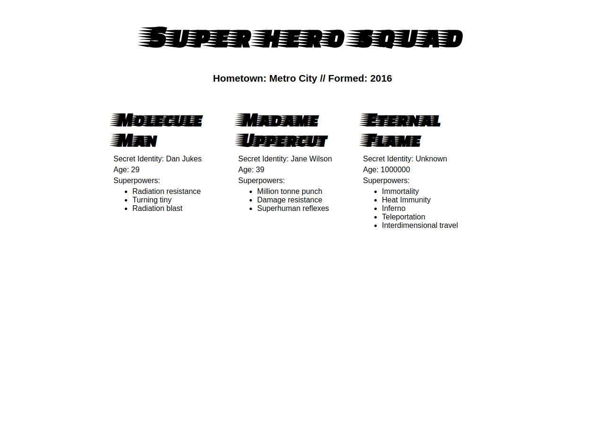

# Superheroes-JSON

This webpage was created by Stefan Klinkusch at Digital Career Institute in Berlin, Germany, using HTML, CSS, and vanilla JavaScript. It consumes the data about three superheroes from [a private API](https://mdn.github.io/learning-area/javascript/oojs/json/superheroes.json) and prints it to the DOM.

## Features

It features
- a ```fetch``` request
- DOM manipulation

## Screenshot


